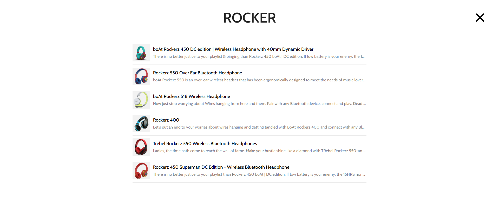

# AudioVerse E-commerce Platform

## Project Description
AudioVerse is a full-stack e-commerce platform designed for electronic gadgets, built with *ReactJS* and *Strapi*. The platform allows users to explore and purchase various electronic products seamlessly. The core focus of AudioVerse is to provide a user-friendly experience for browsing, searching, and purchasing electronic gadgets.

## System Architecture
The AudioVerse platform follows a client-server architecture:
* **Front End:** Built with *ReactJS.*
* **Back End:** Managed by *Strapi*, which serves as the content management system and API provider.
* **Integration:** The front end interacts with the *Strapi* back-end to fetch and display data.

## Front-end
The front end of AudioVerse enhances user experience with the following key pages and features:
* **Homepage:** Displays featured products and navigation to all categories on the site.

  
* **Product List:** Shows a list of available electronic gadgets with filtering and sorting options.

* **Product Details:** Provides detailed information about a specific product, including images, specifications, pricing, and related products.

  
* **Cart:** Allows users to view and manage items they wish to purchase, with options to modify quantities or remove items.

  
* **Checkout:** Facilitates the purchase process, including payment integration and order confirmation.

  
* **Search Functionality:** Enables users to search for products based on their name.

  
* **Category:** Products are categorized into:
  * *Headphones*
  * *Wireless Earbuds*
  * *Bluetooth Speakers*
  * *Smart Watches*
  

## Back-end
The back end of AudioVerse is built with *Strapi*, providing robust API and content management capabilities:
  * **Product Data Management:** Stores and serves data related to products, including categories and specifications.
  * **Integration with Front-end:** Facilitates data retrieval for the front end to render product information on the screen.

## API Design
The AudioVerse platform's API is designed following RESTful principles. Below are the detailed API endpoints:

### Product Endpoints
* *GET* **/api/products**
  * **Description:** Fetch a list of all available products.
  * **Response:** A list of products with details such as name, description, price, and category.

* *GET* **/api/products/{id}**
  * **Description:** Fetch details of a specific product by ID.
  * **Response:** Detailed information about the specified product, including images, specifications, and related products.
  
### Category Endpoints
* *GET* **/api/categories**
  * **Description:** Fetch a list of all product categories.
  * **Response:** A list of categories available on the platform.

### Order Endpoints
* *GET* **/api/orders**
  * **Description:** Fetch a list of all orders (if implemented).
  * **Response:** A list of orders with details such as user ID, status, and total price.
 
## Installation
To set up the *Audio Verse* project locally, follow these steps:
1. **Clone the Repository:**
   * *git clone https://github.com/Abhishek16r/Audio-Verse.git*
3. **Navigate to the project directory:**
   * *cd audioverse*
3. **Install dependencies for the front end:**
   * *cd client*
   * *npm install*
4. **Install dependencies for the back end:**
   * *cd ../api*
   * *npm i stripe*
5. **Run the back end:**
   * *npm run develop*
7. **Run the front end:**
   * *cd ../client*
   * *npm start*
